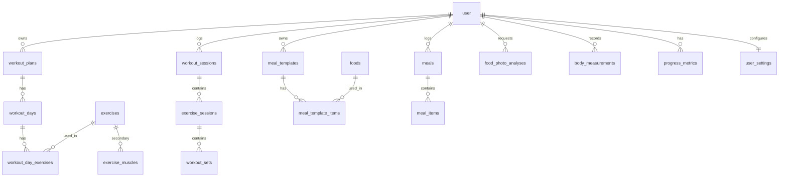

# Database

PostgreSQL via Drizzle ORM. Schema lives in `src/lib/db/schema/` (one file per area). Migrations are generated with `pnpm db:generate` into `drizzle/` and applied with `pnpm db:migrate`.

## Conventions

- Primary keys are `uuid` (`gen_random_uuid()`); Better Auth tables use text ids generated by the library.
- Every user-owned table has a `user_id` referencing `user(id)`.
- Catalog tables (`exercises`, `foods`) use `owner_id`: `NULL` = built-in and shared, otherwise a custom entry owned by one user.
- Weights are stored in kilograms (`numeric`); display units are a UI concern. Money/macros use `numeric`, returned as strings by the driver and converted in repositories.
- "Calendar day" columns are `local_date` (`date`) in the user's timezone at write time, so grouping by day/week never depends on server time.

## Entity overview

## Two layers: plan vs history

**Plan layer (mutable)**: `workout_plans`, `workout_days`, `workout_day_exercises`, `exercises`, `meal_templates`, `meal_template_items`, `foods`.

**History layer (append-only snapshots)**: `workout_sessions`, `exercise_sessions`, `workout_sets`, `meals`, `meal_items`.

How history stays intact when the plan changes:

| History column | Copied from | Link back |
|----------------|-------------|-----------|
| `workout_sessions.name_snapshot`, `focus_snapshot` | `workout_days` | `workout_day_id`, `plan_id` nullable, `SET NULL` |
| `exercise_sessions.name_snapshot`, `primary_muscle_snapshot`, `secondary_muscles_snapshot`, `equipment_snapshot`, targets, RIR targets, `rest_seconds` | `exercises` + `workout_day_exercises` | `exercise_id` nullable, `SET NULL` |
| `workout_sets.target_rep_min/max` | plan item at session start | none |
| `meal_items.name_snapshot`, `grams`, `calories`, `protein`, `carbs`, `fat` | `foods` at log time | `food_id` nullable, `SET NULL` |

Analytics read snapshot columns (muscle group, name), never the live exercise, so a renamed or deleted exercise cannot rewrite old numbers. `workout_day_exercises.exercise_id` is `RESTRICT`: an exercise in use by a plan cannot be hard-deleted (archive it instead via `archived_at`).

## Tables

| Table | Purpose | Notes |
|-------|---------|-------|
| `user`, `session`, `account`, `verification` | Better Auth | Default Better Auth column names |
| `user_settings` | Timezone, units, week start, weekly target, rest timer, nutrition targets | 1 row per user, created at provisioning. Targets are user-entered and nullable |
| `exercises` | Exercise catalog | `primary_muscle`, `movement_type`, nullable `equipment`, default sets/reps, `instructions`, `image_url`, `archived_at` |
| `exercise_muscles` | Secondary muscles | PK `(exercise_id, muscle)` |
| `workout_plans` | A routine | `is_active` |
| `workout_days` | A day in a plan | `weekday` ISO 1-7 (nullable), `position` |
| `workout_day_exercises` | Exercise in a day + training metadata | sets, rep range, `target_rir_min/max`, `allow_failure_on_last_set`, nullable `rest_seconds` |
| `workout_sessions` | One workout performed | `status` in_progress/completed/abandoned, `local_date`. Partial unique index: one `in_progress` per user |
| `exercise_sessions` | Exercise inside a session | Snapshot columns (see above) |
| `workout_sets` | One set | `weight_kg`, `reps`, `target_rep_min/max`, `rir`, `rpe`, `completed`, `completed_at`, `notes`, `is_warmup`. Unique `(exercise_session_id, set_number)` |
| `foods` | Food catalog per 100 g/ml | Optional `piece_label` + `piece_grams` ("3 eggs"), `nutrition_source` |
| `meal_templates`, `meal_template_items` | Editable templates | `option_group` models alternatives (water or milk) |
| `meals`, `meal_items` | Meal log | `source` manual/template/ai_photo, `local_date`, per-item `ai_confidence` |
| `food_photo_analyses` | AI photo requests (Phase 2) | Stores validated `result` JSON, `confidence`, provider/model, never raw model text |
| `body_measurements` | Weight, body fat, waist, chest, arm, leg | Each optional |
| `progress_metrics` | Derived records (PRs) | Recomputable from history (Phase 3) |

## Indexes worth knowing

- `workout_sessions (user_id, started_at)` and `(user_id, local_date)`: history lists and weekly counts.
- `workout_sessions (user_id) WHERE status = 'in_progress'` unique: enforces a single active workout (also resolves double-tap races).
- `exercise_sessions (exercise_id)`: previous-performance and exercise history lookups.
- `meals (user_id, local_date)`: daily nutrition dashboard.
- Partial unique indexes on `exercises`/`foods` slugs for built-ins (`owner_id IS NULL`) and `(owner_id, slug)` for customs.

## Provisioning and seed

`ensureUserProvisioned(userId, timezone)` (called from the signed-in layout, idempotent, transactional) creates `user_settings`, ensures the built-in catalogs exist, then creates the user's starter plan and meal templates from `src/data/starter/`. `pnpm db:seed` does the same for every existing user and can be re-run safely.

## Planned additions

- `exercise_sessions.notes` UI, `workout_sets.rpe` entry (columns exist).
- Weekly rollups / materialised views if analytics queries get slow.
- Row-level security is not used; ownership is enforced in queries (see architecture).
